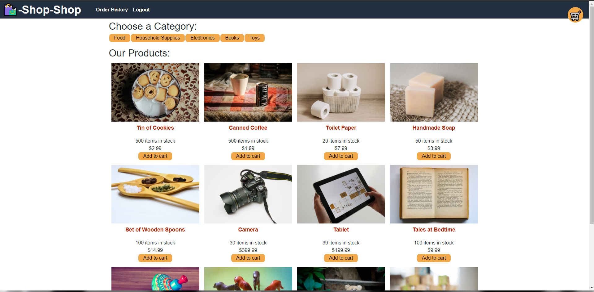

# Challenge-22-Redux-Store

## Tools Used

* JavaScript
* Node.js
* Express
* React
* Redux
* Stripe
* Apollo Server
* Graphql
* Mongodb
* Mongoose
* Dotenv
* Heroku

# Snapshot

# Installation & Database SetUp
* To use this app npm init has to be called to create your package.json file.
* The following necessary Npm dependencies must be installed to run the application properly: the needed dependencies will be found on the package.json file.
* To properly install the database you must create at cluster on Mongodb atlas.
* Run "npm run seed" to properly introduce seeded items"
* Run "npm start" for the port to start listening with mongoose.
* This app is deployed on Heroku

